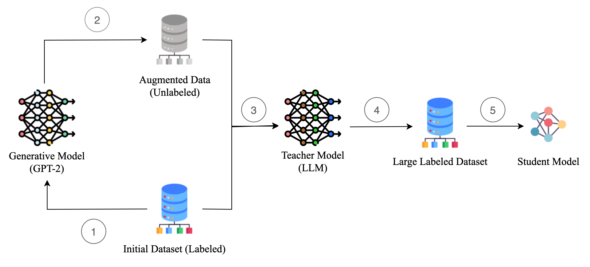

# Effective Knowledge Distillation Generalization for Language Models

With the increasing prevalence of large-scale machine learning and deep learning models, deploying such models on real-world hardware becomes harder. Knowledge distillation can transfer knowledge from such cumbersome models to smaller, shallow models. These distilled models aim to capture the larger models’ knowledge into a smaller single model, which is easier to deploy without significant loss in performance. In this work, we propose a new diverse dataset along with a student-teacher architecture for our distillation tasks, utilizing generative models for dataset augmentation. Then, this dataset is used to transfer knowledge from the teacher model to the student model. The proposed student model with knowledge distillation and augmented transfer set has reached over 88% accuracy of the teacher model in multiple tasks while having a small and simple architecture.

## An overview of our approach

Our proposed distillation procedure with generative models, large language models (LLMs), and BiLSTM. The labels are as follows: 

1. `transferset_generation`: Fine-tuning a generative model (GPT-2) using the initial
dataset.

2. `transferset_generation` & `data_cleaning`: Generation of the augmented dataset using fine-tuned GPT-2. 

3. `teacher_fine_tuning` & `teacher_sent_similarity_fine_tuning`: Fine-tuning LLMs (BERT, RoBERTA) with the initial dataset and prediction for augmented data using fine-tuned LLMs.

4. `data_cleaning`: Combining the initial dataset with labeled augmented data (transfer dataset). 

5. `student-model`: Training the student model (BiLSTM) with the transfer dataset.
